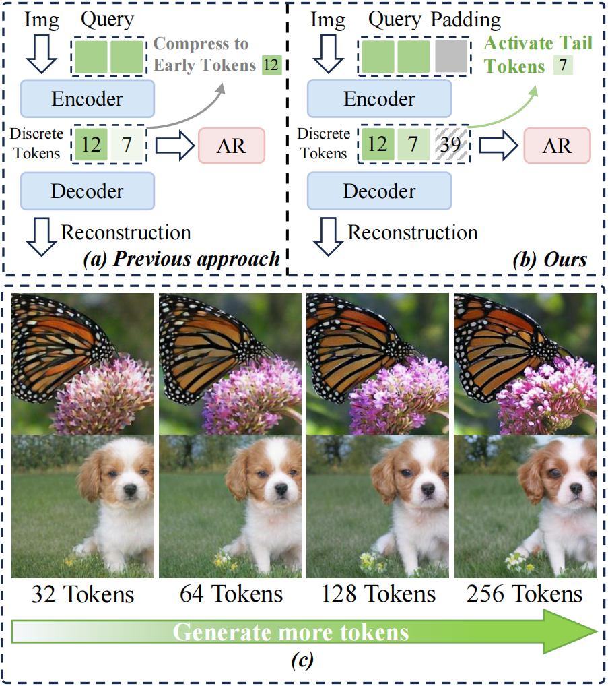
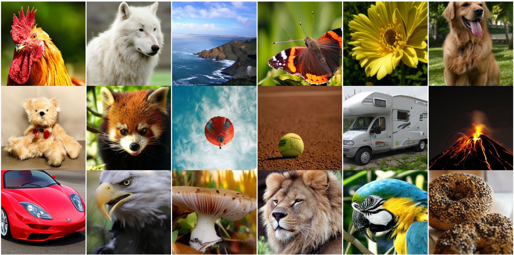

# Improving Flexible Image Tokenizers for Autoregressive Image Generation


<div align="center">

[](https://arxiv.org/abs/2601.01535)&nbsp;
<!-- [](https://huggingface.co/YuuTennYi/GigaTok)&nbsp; -->
</div>

<div align="center">
  <a href="https://scholar.google.com/citations?user=iWALaSYAAAAJ&hl" target="_blank">Zixuan&nbsp;Fu</a><sup>1</sup> &ensp; <b>&middot;</b> &ensp;
  <a href="https://scholar.google.com/citations?user=8rkIFHcAAAAJ&hl" target="_blank">Lanqing&nbsp;Guo</a><sup>2</sup> &ensp; <b>&middot;</b> &ensp;
  <a href="https://scholar.google.com/citations?user=QlZK_hQAAAAJ&hl" target="_blank">Chong&nbsp;Wang</a><sup>1</sup> &ensp; <b>&middot;</b> &ensp;
  <a href="https://scholar.google.com/citations?user=IafpXb1o2V8C&hl" target="_blank">Binbin&nbsp;Song</a><sup>3</sup> &ensp; <b>&middot;</b> &ensp;
  <a href="https://scholar.google.com/citations?user=PGtHUI0AAAAJ&hl" target="_blank">Ding&nbsp;Liu</a><sup>4</sup> &ensp; <b>&middot;</b> &ensp;
  <a href="https://scholar.google.com/citations?user=ypkClpwAAAAJ&hl" target="_blank">Bihan&nbsp;Wen</a><sup>1✉</sup><br>
  <sup>1</sup>Nanyang Technological University &emsp; <sup>2</sup>The University of Texas at Austin &emsp;  <br>
  <sup>3</sup>Harbin Institute of Technology &emsp; <sup>4</sup>Meta AI &emsp;  <br>

</div>
<br>


## 📝 To do List

- ✅ **Release evaluation code.** (Done)
- ✅ **Release model weights.** (Done)
- 🔲 **Release training code.** (In progress)


## Introduction

<p align="center">

<p>


Flexible image tokenizers aim to represent an image using an ordered 1D variable-length token sequence. 
This flexible tokenization is typically achieved through nested dropout, where a portion of trailing tokens is randomly truncated during training, and the image is reconstructed using the remaining preceding sequence.
However, this tail-truncation strategy inherently concentrates the image information in the early tokens, limiting the effectiveness of downstream AutoRegressive (AR) image generation as the token length increases.
To overcome these limitations, we propose **ReToK**, a flexible tokenizer with <u>Re</u>dundant <u>Tok</u>en Padding and Hierarchical Semantic Regularization, designed to fully exploit all tokens for enhanced latent modeling.
Specifically, we introduce **Redundant Token Padding** to activate tail tokens more frequently, thereby alleviating information over-concentration in the early tokens. 
In addition, we apply **Hierarchical Semantic Regularization** to align the decoding features of earlier tokens with those from a pre-trained vision foundation model, while progressively reducing the regularization strength toward the tail to allow finer low-level detail reconstruction. 
Extensive experiments demonstrate the effectiveness of ReTok: on ImageNet $256 \times 256$, our method achieves superior generation performance compared with both flexible and fixed-length tokenizers. 


## Environment Setup

Follow these steps to create a main environment and a seperate environment for metrics calculation (FID/IS):

### Primary Environment
```shell
# A working CUDA version: 12.1
# Correspond to TORCH_RUN_PATH in set_env_vars.sh
conda create -n retok python=3.9
conda activate retok
# Install required packages using the provided script
bash env_install.sh
```

### Evaluation Environment
```shell
# This is the environment for evaluation. Correspond to EVAL_PYTHON_PATH in set_env_vars.sh
conda create -n tok_eval python=3.9
conda activate tok_eval

# cuda 12.1
pip install numpy==1.23.5
pip install scipy
pip install tqdm
conda install tensorflow-gpu # Ensures all CUDA/cuDNN dependencies are linked correctly
```

For detailed instructions, please refer to the [Detailed Instructions](https://github.com/SilentView/GigaTok/blob/master/Detailed_instructions.md).

[!IMPORTANT] Switching Back: Once the evaluation environment is set up, always ensure you switch back to the primary environment to run the main scripts.


## Download Checkpoints

All the tokenizers are for 256x256 images. You can also download the models from [Google Drive](https://drive.google.com/drive/folders/1Qne5GwCILuJVH_fqQSN2MQFK7YF82UAn?usp=sharing). Place the pretrained models in ``checkpoints`` folder.

## Evaluation

### Tokenizer Reconstruction

1\. **Extract validation data for reconstruction**  
Sample 50k images from ImageNet validation set (download first). This will create results/reconstructions/val_imagenet.npz, and also results/reconstructions/img_data/ for the 256x256 val images.
```shell
. set_env_vars.sh  # Note to set TORCH_RUN_PATH, IMGNET_ROOT in set_env_vars.sh first
bash scripts/val.sh \
--data-path ${IMGNET_ROOT}/ILSVRC2012_img_val/ \
--sample-dir results/reconstructions/img_data
```
Set **VAL_PATH** according to --sample-dir results/reconstructions/img_data in set_env_vars.sh.

2\. **Evalute reconstructed samples**  
```shell
# remember to set all variables in set_env_vars.sh
. set_env_vars.sh

export VAL_PATH=results/reconstructions/img_data/
# use absolute path
export GT_VAL_NPZ_PATH=${PROJECT_ROOT}/results/reconstructions/img_data/val_imagenet.npz

export VQ_CKPT=checkpoints/VQ_SB256_e250.pt
export TOK_CONFIG="configs/vq/VQ_SB256.yaml"
export SAMPLE_DIR=${PROJECT_ROOT}/results/vq/VQ_SB256 # Use absolute dir

bash scripts/reconstruction.sh \
--data-path $VAL_PATH \
--image-size 256 \
--quant-way vq \
--sample-dir $SAMPLE_DIR \
--vq-ckpt $VQ_CKPT \
--model-config ${TOK_CONFIG} \
--clear-cache \
--eval-python-path ${EVAL_PYTHON_PATH} \
--gt-npz-path ${GT_VAL_NPZ_PATH}
```

For the quantitative reconstruction evaluation, see [Detailed_instructions](Detailed_instructions.md)

### AR Generation

1\. **Download the reference batch for gFID**
```shell
# download reference batch for gFID calculation
wget https://openaipublic.blob.core.windows.net/diffusion/jul-2021/ref_batches/imagenet/256/VIRTUAL_imagenet256_labeled.npz
```

For the quantitative evaluation, see [Detailed_instructions](Detailed_instructions.md)

2\. **Calculating gFID**

```shell
. set_env_vars.sh

export VQ_CKPT=${PROJECT_ROOT}/checkpoints/VQ_SB256_e250.pt
export TOK_CONFIG="configs/vq/VQ_SB256.yaml"

export GPT_CKPT=${PROJECT_ROOT}/checkpoints/GPT_XL256_e300_VQ_SB.pt
export GPT_MODEL="GPT-XL"
export SAMPLE_DIR=${PROJECT_ROOT}/results/gpt/quan_eval/GPT_XL256_e300_VQ_SB/
export PRECISION="none" # fp32

export CFG_SCHEDULE="step"
export CFG_START_RATIO="0.18"
export CFG_SCALE=1.5
export EVAL_BATCH_PER_GPU=32
export SEED=0

# use absolute path, make sure it is downloaded
export GT_NPZ_PATH=${PROJECT_ROOT}/VIRTUAL_imagenet256_labeled.npz

# If you want to search for the best cfg scale, add `--search`
bash scripts/sample_c2i_search_cfg.sh \
--quant-way=vq \
--image-size=256 \
--sample-dir=${SAMPLE_DIR} \
--cfg-scale ${CFG_SCALE} \
--vq-ckpt $VQ_CKPT \
--tok-config ${TOK_CONFIG} \
--gpt-model ${GPT_MODEL} \
--cfg-schedule $CFG_SCHEDULE \
--step-start-ratio $CFG_START_RATIO \
--gpt-ckpt $GPT_CKPT \
--per-proc-batch-size $EVAL_BATCH_PER_GPU \
--precision ${PRECISION} \
--eval-python-path ${EVAL_PYTHON_PATH} \
--gt-npz-path ${GT_NPZ_PATH} \
--global-seed ${SEED} \
--clear-cache
```

## Results

### Visual Examples 
<p align="center">

<p>

### Quantitative Results
<p align="center">

<p>

## Reference
Our implementation is based on [GigaTok](https://github.com/SilentView/GigaTok) and [LlamaGen](https://github.com/FoundationVision/LlamaGen).  We would like to thank them.


## Citation

```
@article{fu2026improving,
  title={Improving Flexible Image Tokenizers for Autoregressive Image Generation},
  author={Fu, Zixuan and Guo, Lanqing and Wang, Chong and Song, Binbin and Liu, Ding and Wen, Bihan},
  journal={arXiv preprint arXiv:2601.01535},
  year={2026}
}
```